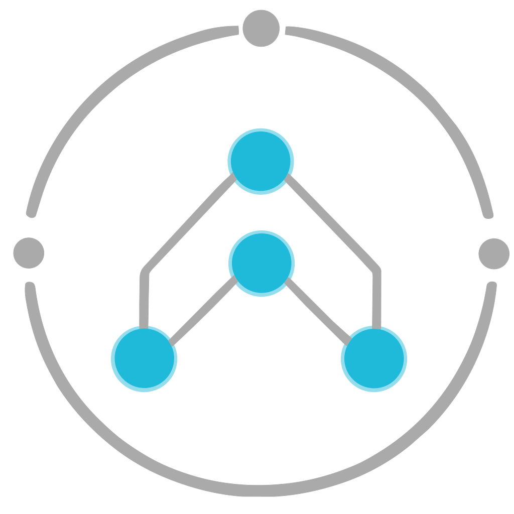

<div align="center">
  
<h1>Nova Suite</h1>
</div>


**Open-source IT Service Management (ITSM) platform.**

Nova Suite provides a complete service management solution — service catalog, incident management, CMDB, workflow automation, SSO, AI assistant, and a modern admin dashboard — all with built-in multi-tenancy and row-level security.

## Features

### User Portal
- Self-service catalog with dynamic request forms and CMDB reference fields
- Shopping cart for multi-item requests
- Approval workflows with manager-based routing
- Real-time request status tracking
- Personal task views (My Todo, My Groups)
- **AI assistant (ESS)** — catalog search, knowledge base lookup, and draft incidents (with confirmation before create)

### Incident Management
- Full incident lifecycle (new → in progress → resolved → closed)
- SLA tracking with configurable breach actions
- Priority matrix with impact/urgency calculation
- Assignment to users and groups
- Journal / activity log with comments and work notes
- Default "active" filter (excludes closed) for efficient triage
- **AI assistant (Agent)** — incident context, KB suggestions, draft work notes, and catalog automation proposals (with confirmation before write)

### CMDB (Configuration Management Database)
- Extensible CI classes with parent/child inheritance (child classes inherit parent attributes)
- Class-specific attributes (string, integer, number, boolean)
- CI creation wizard with dynamic attribute forms
- Relationship management (depends_on, used_by, runs_on, connected_to, part_of, manages)
- Recursive impact analysis (blast radius)
- Full audit trail with relationship change history
- Supported By group field for support ownership
- Record navigation (prev/next) on CI detail pages

### Administration
- **User Management** — Create, edit, delete users with record navigation; auto-calculated display names (Lastname, Firstname (ID))
- **Organization** — Departments, Cost Centers, Assignment Groups
- **Service Catalog** — Services, Catalog Items with custom fields, Catalog Tasks
- **Process & Automation** — Processes, Workflows (Temporal), SLA Configuration
- **CMDB** — CI Classes with attribute builder and inheritance
- **Data & Integration** — Data Sources (REST/CSV/DB with scheduled imports via Temporal), Import History
- **System** — Roles, Theming (colors, logo, app name)
- Organized sub-menu navigation with auto-expand

### Data Tables
- Drag-and-drop column reordering
- Per-column "starts with" filter fields
- Column visibility picker
- Persistent user preferences (columns, sort order) via localStorage
- Server-side pagination for large datasets

### Security & Identity
- Multi-tenant architecture with PostgreSQL Row-Level Security
- JWT-based authentication
- SSO via OpenID Connect providers (Google-first) with auto-provisioning
- Role-based access control (admin, fulfiller, user, configuration_manager)

## Tech Stack

| Layer          | Technology                              |
|----------------|-----------------------------------------|
| Frontend       | React 18 + TypeScript + Tailwind CSS    |
| Backend        | Node.js 24+ / Express / TypeScript      |
| Validation     | Zod                                     |
| Database       | PostgreSQL 18 with Row-Level Security   |
| Auth           | JWT + OpenID Connect (Google-ready)     |
| Workflows      | Temporal                                |
| Web Server     | Caddy (reverse proxy, auto-TLS)         |
| Orchestration  | Docker Compose                          |

## Quick Start

```bash
# 1. Clone and configure
git clone <your-repo-url> nova-suite
cd nova-suite
cp .env.example .env
# Edit .env — change POSTGRES_PASSWORD and JWT_SECRET

# 2. Start everything
docker compose up -d

# 3. Wait ~30 seconds for initialization, then verify
curl http://localhost:4000/health

# 4. Access
# Web UI:        http://localhost (port 80)
# API Docs:      http://localhost/docs
# Temporal UI:   http://localhost:8080
```

**Default credentials** (quick-fill buttons on the login page; hide in production with `VITE_HIDE_DEMO_LOGIN_CREDENTIALS=true` in `.env`, then rebuild `nova-web`):

| Role                   | Email                    | Password   |
|------------------------|--------------------------|------------|
| Admin                  | `admin@acme.local`       | `admin123` |
| Fulfiller              | `fulfiller@acme.local`   | `admin123` |
| User (Employee)        | `user@acme.local`        | `admin123` |

### Core environment variables

Core env configuration is documented in `docs/ENVIRONMENT.md`.
Use `.env.example` as the baseline and keep deployment manifests aligned with that file.

### Optional AI assistant

The AI assistant is **disabled by default**. Enable it in `.env` and restart `nova-engine`:

```bash
AI_ENABLED=true
AI_DEFAULT_PROVIDER=openai   # openai | azure_openai | ollama
OPENAI_API_KEY=sk-...
OPENAI_MODEL=gpt-4o-mini
```

For local models via Ollama:

```bash
AI_DEFAULT_PROVIDER=ollama
OLLAMA_BASE_URL=http://localhost:11434
OLLAMA_MODEL=llama3.2
```

See [docs/AI_ASSISTANT.md](docs/AI_ASSISTANT.md) for Azure OpenAI, Docker Compose, personas, API, and security notes.

### Optional Google OIDC setup

Set these values in `.env` and restart `nova-engine`:

```bash
OIDC_ISSUER=https://accounts.google.com
OIDC_CLIENT_ID=<google-oauth-client-id>
OIDC_CLIENT_SECRET=<google-oauth-client-secret>
OIDC_REDIRECT_URI=http://localhost/api/auth/sso/callback
OIDC_PROVIDER_NAME=Google
OIDC_SCOPE=openid email profile
```

Google OAuth redirect URI must exactly match `OIDC_REDIRECT_URI`.

### SSO-only mode (disable local password login)

Set this in `.env`:

```bash
AUTH_LOCAL_LOGIN_ENABLED=false
```

When disabled:
- Login page hides local email/password form and demo credentials
- `POST /api/auth/login` is blocked
- SSO remains available via `/api/auth/sso/authorize`

### Optional Microsoft Entra ID OIDC setup

Set these values in `.env` and restart `nova-engine`:

```bash
# Use your tenant ID (GUID) or "common" for multi-tenant apps
OIDC_ISSUER=https://login.microsoftonline.com/<tenant-id>/v2.0
OIDC_CLIENT_ID=<entra-app-client-id>
OIDC_CLIENT_SECRET=<entra-app-client-secret>
OIDC_REDIRECT_URI=http://localhost/api/auth/sso/callback
OIDC_PROVIDER_NAME=Microsoft Entra ID
OIDC_SCOPE=openid profile email
```

In Entra app registration, add a Web redirect URI that exactly matches `OIDC_REDIRECT_URI`.

## Services

| Service        | Port  | Description                          |
|----------------|-------|--------------------------------------|
| Caddy          | 80    | Reverse proxy — main entry point     |
| Nova Web       | 3000  | React SPA (served via Caddy)         |
| Nova Engine    | 4000  | Backend REST API                     |
| PostgreSQL     | 5432  | Database                             |
| Temporal       | 7233  | Workflow engine (gRPC)               |
| Temporal UI    | 8080  | Workflow monitoring dashboard        |

## Project Structure

```
nova-suite/
├── packages/
│   ├── nova-engine/              # Backend API
│   │   └── src/
│   │       ├── index.ts          # Express app, Swagger UI, health, metrics
│   │       ├── config.ts         # Environment config
│   │       ├── logger.ts
│   │       ├── api/
│   │       │   ├── routes.ts     # Main router
│   │       │   ├── roles.ts      # Route → role metadata
│   │       │   ├── admin/        # Users, roles, org, catalog admin, imports, ...
│   │       │   ├── ai/           # AI conversations, SSE chat, confirm actions
│   │       │   ├── approvals/    # Approval tasks
│   │       │   ├── assets/
│   │       │   ├── attachments/
│   │       │   ├── auth/         # Login, SSO, session
│   │       │   ├── cart/
│   │       │   ├── catalog/      # Categories, items, task automation config
│   │       │   ├── changes/
│   │       │   ├── cmdb/
│   │       │   ├── config-packages/
│   │       │   ├── credentials/
│   │       │   ├── datasources/
│   │       │   ├── import/
│   │       │   ├── incidents/
│   │       │   ├── knowledge/
│   │       │   ├── major-incidents/
│   │       │   ├── notifications/
│   │       │   ├── problems/
│   │       │   ├── releases/
│   │       │   ├── reports/
│   │       │   ├── requests/
│   │       │   ├── search/
│   │       │   ├── settings/     # Theme and app settings
│   │       │   └── temporal/     # Enqueue / inspect workflows
│   │       ├── audit/
│   │       ├── cache/            # Redis + cache metrics
│   │       ├── data/
│   │       │   └── db.ts         # Database pool + RLS helpers
│   │       ├── domain/
│   │       │   ├── schemas.ts    # Zod models + OpenAPI extensions
│   │       │   └── sla.ts
│   │       ├── middleware/       # auth, validation, errors
│   │       ├── ai/               # LLM providers, orchestrator, tools, prompts
│   │       ├── notifications/    # DB-side notification triggers
│   │       ├── observability/    # Prometheus metrics middleware
│   │       ├── openapi/          # OpenAPI 3 spec (registerPaths + generator)
│   │       └── temporal/         # Workflow definitions + start-queue dispatcher
│   ├── nova-web/                 # Frontend SPA (Vite + React)
│   │   └── src/
│   │       ├── main.tsx
│   │       ├── App.tsx
│   │       ├── api/client.ts     # API client + shared types
│   │       ├── components/       # Layout, DataTable, workflow designer, ai/, ...
│   │       ├── hooks/
│   │       ├── context/          # Auth, cart, locale, theme
│   │       ├── i18n/             # Locales and JSON message catalogs
│   │       ├── pages/
│   │       │   ├── Dashboard.tsx, Login.tsx, profile, search, My Todo / My Groups
│   │       │   ├── admin/        # Admin console + workflow editor
│   │       │   ├── catalog/      # Catalog + cart
│   │       │   ├── changes/
│   │       │   ├── cmdb/
│   │       │   ├── ess/          # Employee self-service home + approvals
│   │       │   ├── incidents/
│   │       │   ├── knowledge/
│   │       │   ├── major-incidents/
│   │       │   ├── problems/
│   │       │   ├── reports/
│   │       │   ├── requests/
│   │       │   └── todo/
│   │       └── utils/
│   ├── nova-shared/              # Shared automation contracts for engine + worker
│   │   └── src/
│   │       ├── index.ts
│   │       ├── automation-config.ts
│   │       ├── catalog-links.ts  # Shared catalog link normalization
│   │       ├── automation-builder-defaults.ts
│   │       └── automation-fixtures.ts
│   └── nova-worker/              # Temporal worker (activities + workflows)
│       └── src/
│           ├── worker.ts
│           ├── config.ts
│           ├── db.ts
│           ├── credentials/      # Secret provider helpers
│           ├── activities/       # Catalog, datasource, email, incidents, ...
│           └── workflows/        # Fulfillment, sync, notifications, major incidents, ...
├── infra/
│   ├── postgres/
│   │   ├── init.sql              # Schema + seed data
│   │   ├── rls.sql               # Row-Level Security policies
│   │   └── 03-demo-data.sql      # Demo tenants / records
│   └── caddy/
│       └── Caddyfile             # Reverse proxy config
├── docs/
│   ├── ARCHITECTURE.md
│   ├── AI_ASSISTANT.md
│   ├── CATALOG_TASK_AUTOMATION.md
│   ├── ENVIRONMENT.md
│   ├── HIGH_AVAILABILITY.md
│   ├── OBSERVABILITY.md
│   ├── OPERATIONS_RUNBOOK.md
│   └── UPGRADE_STRATEGY.md
├── scripts/                      # Backup / maintenance helpers
├── .github/                      # CI workflows
├── docker-compose.yml
├── .env.example
└── package.json
```

## API Overview

All endpoints are prefixed with `/api`. Full interactive documentation is available at `/docs` (Swagger UI).

| Endpoint                            | Method          | Auth              | Description                            |
|-------------------------------------|-----------------|-------------------|----------------------------------------|
| `/api/auth/login`                   | POST            | None              | Get JWT token                          |
| `/api/auth/sso/authorize`           | GET             | None              | Initiate SSO login via OIDC            |
| `/api/auth/me`                      | GET             | Any               | Current user info                      |
| `/api/auth/users`                   | GET             | Admin / FF / User | List users (for pickers)               |
| `/api/catalog/categories`           | GET             | Any               | List service categories                |
| `/api/catalog/items`                | GET             | Any               | List service items                     |
| `/api/requests`                     | GET/POST        | Any               | List / submit service requests         |
| `/api/requests/:id/approve`         | POST            | Admin / FF        | Approve or reject a request            |
| `/api/incidents`                    | GET             | Any               | List incidents (scoped for non-FF)     |
| `/api/incidents`                    | POST            | Admin / FF        | Create incident (agent)                |
| `/api/incidents/ess`                | POST            | User              | use `POST /api/incidents`              |
| `/api/incidents/:id`                | PATCH           | Varies            | Update (FF: full; caller: limited)     |
| `/api/incidents/:id/journal`        | GET/POST        | Varies            | Activity log entries                   |
| `/api/ai/status`                    | GET             | Any               | AI feature flags (no LLM call)         |
| `/api/ai/conversations`             | POST            | Any               | Start AI chat thread                   |
| `/api/ai/conversations/:id/messages`| POST            | Any               | Send message (SSE when `stream: true`) |
| `/api/ai/conversations/:id/actions/:actionId/confirm` | POST | Any        | Confirm pending AI action (write)      |
| `/api/cmdb/classes`                 | GET             | Any               | List CI classes                        |
| `/api/cmdb/classes`                 | POST            | Admin / CM        | Create CI class                        |
| `/api/cmdb/classes/:id`             | PUT             | Admin / CM        | Update CI class                        |
| `/api/cmdb/classes/:id`             | DELETE          | Admin             | Delete CI class (no CIs on class)      |
| `/api/cmdb/items`                   | GET/POST        | Varies            | List / create configuration items      |
| `/api/cmdb/items/:id`               | GET/PATCH       | Varies            | CI details / update                    |
| `/api/cmdb/items/:id/history`       | GET             | Any               | CI audit trail                         |
| `/api/cmdb/items/:id/impact`        | GET             | Any               | Impact analysis (blast radius)         |
| `/api/cmdb/relationships`           | GET             | Any               | List CI relationships                  |
| `/api/cmdb/relationships`           | POST            | Admin / FF / CM   | Create CI relationship                 |
| `/api/cmdb/relationships/:id`       | DELETE          | Admin / FF / CM   | Remove a relationship                  |
| `/api/admin/users`                  | GET/POST        | Admin             | User management                        |
| `/api/admin/users/:id`              | PATCH/DELETE    | Admin             | Update / delete user                   |
| `/api/admin/roles`                  | GET/POST        | Admin             | Role management                        |
| `/api/admin/departments`            | GET/POST        | Admin             | Department management                  |
| `/api/admin/cost-centers`           | GET/POST        | Admin             | Cost center management                 |
| `/api/admin/assignment-groups`      | GET/POST        | Admin             | Assignment group management            |
| `/api/admin/services`               | GET/POST        | Admin             | Service management                     |
| `/api/admin/processes`              | GET/POST        | Admin             | Process management                     |
| `/api/settings/theme`               | GET             | None              | Public theming (e.g. login page)       |
| `/api/settings`                     | GET/PUT         | Admin             | List / bulk-update tenant settings     |

**Roles:** Admin = full access, Fulfiller (FF) = incident/request management, Configuration Manager (CM) = CMDB editing, User = self-service only. The table is a **sample**; use `/docs` for every route (changes, problems, knowledge, major incidents, cart, search, …).

## Documentation

- [QUICKSTART.md](QUICKSTART.md) — 5-minute setup guide
- [PROJECT_SUMMARY.md](PROJECT_SUMMARY.md) — Feature summary
- [docs/ARCHITECTURE.md](docs/ARCHITECTURE.md) — System design & decisions
- [docs/AI_ASSISTANT.md](docs/AI_ASSISTANT.md) — AI assistant (ESS + Agent personas, providers, API)
- [docs/HIGH_AVAILABILITY.md](docs/HIGH_AVAILABILITY.md) — HA deployment
- [docs/UPGRADE_STRATEGY.md](docs/UPGRADE_STRATEGY.md) — Zero-downtime upgrades
- [docs/CATALOG_TASK_AUTOMATION.md](docs/CATALOG_TASK_AUTOMATION.md) — Catalog task HTTP automation (`automation_config`)

## Development

```bash
cd packages/nova-engine
npm install
npm run dev          # Watch mode with hot reload
npm run build        # Compile TypeScript
npm test             # Run tests
npm run typecheck    # Type check without emitting
```

```bash
cd packages/nova-web
npm install
npm run dev          # Vite dev server with HMR
npm run build        # Production build
```

## License

**AGPL-3.0** — You must open-source modifications if running as a service. See [LICENSE](LICENSE) for details.
